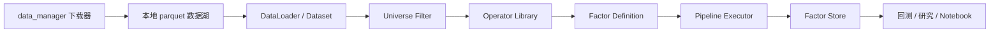
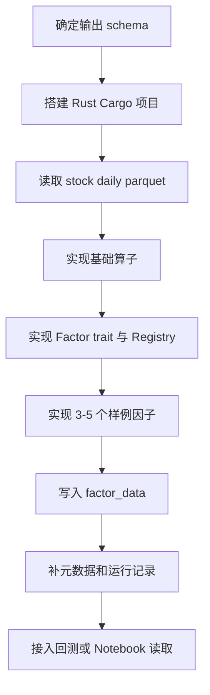

# 因子生成模块设计草案

本文档描述后续因子生成模块的推荐技术选型、目录结构、模块职责、因子组织方式和算子系统设计。当前阶段只做架构设计，不实现具体 alpha 因子代码。

## 1. 技术选型建议

推荐优先使用 Rust。

理由：

- 当前项目的数据已经以 parquet 为核心落盘，Rust 的 Arrow / Parquet / Polars 生态很适合做离线列式计算。
- 因子生成属于批量数据处理，不是纳秒级撮合或低延迟交易系统，Rust 的安全性、并发能力、工程可维护性比 C++ 更划算。
- Rust 的 trait、enum、Result 错误处理和 Cargo 工程管理更适合长期扩展一个因子计算框架。
- 未来如果需要 Python 研究环境接入，可以用 PyO3 暴露接口；如果只做命令行批处理，也可以保持纯 Rust。

C++ 适合的情况：

- 未来要接入已有 C++ 回测/交易基础设施。
- 需要复用大量现成 C++ 数值库。
- 目标是低延迟在线计算，而不只是离线因子生产。

对当前项目而言，建议路线是：

```text
Python/Tushare 数据下载层 -> parquet 数据湖 -> Rust 因子计算引擎 -> parquet 因子库 -> Python/Notebook/回测读取
```

## 2. 顶层目录建议

建议新增两个区域：

- `factor_engine/`：Rust 因子计算引擎源码。
- `data/factor_data/`：因子计算结果落盘目录。

推荐结构：

```text
YuminQuant/
  data/
    stock_data/
    future_data/
    index_data/
    factor_data/
      stock/
        daily/
          raw/
          adjusted/
          neutralized/
        minute/
      future/
        daily/
        minute/
      metadata/
        factor_registry.parquet
        factor_runs.parquet
  factor_engine/
    Cargo.toml
    README.md
    configs/
      stock_daily.toml
      future_daily.toml
    src/
      main.rs
      lib.rs
      cli.rs
      config.rs
      calendar.rs
      data/
        mod.rs
        parquet_reader.rs
        parquet_writer.rs
        schema.rs
        dataset.rs
      universe/
        mod.rs
        stock_universe.rs
        future_universe.rs
        index_membership.rs
      operators/
        mod.rs
        arithmetic.rs
        rolling.rs
        timeseries.rs
        cross_section.rs
        transform.rs
        neutralize.rs
        winsorize.rs
        missing.rs
      factors/
        mod.rs
        registry.rs
        factor.rs
        tags.rs
        defs/
          mod.rs
          alpha_001.rs
          alpha_002.rs
          alpha_003.rs
          momentum_20.rs
          volatility_20.rs
      pipeline/
        mod.rs
        context.rs
        planner.rs
        executor.rs
        dependency.rs
      output/
        mod.rs
        factor_store.rs
        metadata.rs
      tests/
        mod.rs
```

## 3. 数据流设计图



## 4. 模块职责

### `data/`

负责读取现有 parquet 数据。

核心职责：

- 读取股票日线、分钟线、财务、指数成分、期货行情等数据。
- 统一日期字段、代码字段和数据类型。
- 给上层提供按区间、按频率、按资产类别的数据集接口。

建议抽象：

```text
Dataset
  asset_type: stock / future / index / option
  frequency: daily / minute
  start_date
  end_date
  columns
```

### `universe/`

负责股票池、期货合约池、指数成分池。

常见 universe：

- 全 A 股
- 沪深 300
- 中证 500
- 中证 1000
- 申万一级/二级行业
- 非 ST、非停牌、上市满 N 天
- 主力期货合约池

`sw_members.parquet`、`ci_members.parquet` 这类指数成分数据就应该在这里被使用。

### `operators/`

负责可复用的基础算子，避免每个因子重复造轮子。

算子分层建议：

```text
基础算术:
  add, sub, mul, div, log, abs, sign, pow

时间序列:
  delay, delta, pct_change, ts_sum, ts_mean, ts_std, ts_min, ts_max
  ts_rank, ts_argmax, ts_argmin, rolling_corr, rolling_cov

横截面:
  rank, zscore, demean, quantile_bucket

数据清洗:
  fill_nan, mask, winsorize, clip, replace_inf

中性化:
  industry_neutralize, size_neutralize, beta_neutralize

组合算子:
  decay_linear, signed_power, scale, residualize
```

设计原则：

- 算子只做通用数学和数据处理，不绑定具体因子名称。
- 算子输入输出应尽量统一为 `Series`、`DataFrame` 或内部 `FactorFrame`。
- 时间序列算子必须明确按 `ts_code` 分组。
- 横截面算子必须明确按 `trade_date` 分组。
- 所有算子都要处理缺失值规则。

### `factors/`

负责因子定义。

推荐采用“一个因子一个文件 + tag 分类”的方式。

原因：

- 研究阶段很多因子一开始只是实验表达式，未必能立刻判断属于动量、反转、质量还是流动性。
- 一个因子一个文件便于单因子重算、单因子版本管理和独立 review。
- 分类不应该强绑定到目录结构，应该通过 tag 元数据表达。
- 同一个因子可以有多个 tag，例如同时属于 `price_volume`、`momentum`、`short_horizon`、`experimental`。

推荐粒度：

```text
factors/defs/alpha_001.rs
  Alpha001
  tags: ["experimental", "price_volume", "cross_section"]

factors/defs/momentum_20.rs
  Momentum20
  tags: ["price_volume", "momentum", "daily"]

factors/defs/amihud_illiq_20.rs
  AmihudIlliq20
  tags: ["price_volume", "liquidity", "daily"]

factors/defs/ep_ttm.rs
  EpTtm
  tags: ["fundamental", "valuation", "quarterly_update"]
```

目录层面可以保持较平的 `defs/` 结构。等因子数量非常多之后，可以按生命周期拆目录，例如：

```text
factors/defs/research/
factors/defs/production/
factors/defs/deprecated/
```

但不建议一开始按研究含义拆成 `momentum/`、`liquidity/`、`quality/` 等目录。研究含义交给 tag 系统维护。

tag 建议分几类：

```text
数据来源:
  price_volume, fundamental, analyst, industry, alternative

经济含义:
  momentum, reversal, volatility, liquidity, valuation, growth, quality, sentiment

计算方式:
  time_series, cross_section, rolling, residual, neutralized

频率:
  daily, minute, quarterly_update

状态:
  experimental, candidate, production, deprecated
```

`tags.rs` 可以集中定义常用 tag 常量，避免拼写漂移。`registry.rs` 负责读取每个因子的 tag，并支持按 tag 查询和批量运行。

### `pipeline/`

负责把数据、universe、算子、因子定义串成可执行任务。

核心职责：

- 根据配置读取日期区间、资产类别、频率和因子列表。
- 分析因子依赖的原始列。
- 合并重复读取，减少 I/O。
- 按日期或年份切片计算。
- 并行执行互不依赖的任务。
- 把结果写入 factor store。

### `output/`

负责因子落盘和元数据记录。

推荐输出结构：

```text
data/factor_data/stock/daily/raw/momentum_20/2026.parquet
data/factor_data/stock/daily/raw/reversal_20/2026.parquet
data/factor_data/stock/daily/neutralized/momentum_20/2026.parquet
```

每个因子文件建议至少包含：

```text
trade_date
ts_code
factor_value
```

如果采用宽表，也可以一年一个文件：

```text
data/factor_data/stock/daily/raw/2026.parquet
  trade_date, ts_code, momentum_20, reversal_20, volatility_20, ...
```

推荐初期使用“一个因子一个目录，按年文件”的长表结构。优点是：

- 单因子重算简单。
- 因子版本管理简单。
- 不会因为新增一个因子重写巨大的宽表。
- 适合批量生产和增量更新。

后续如果回测读取宽表更方便，可以再增加一个 materialize 步骤，把多个因子拼成宽表。

## 5. 因子接口设计

推荐每个因子实现统一接口：

```text
Factor
  name()
  version()
  tags()
  frequency()
  required_columns()
  warmup_window()
  compute(context) -> FactorFrame
```

字段含义：

- `name`：因子唯一名称，例如 `momentum_20`。
- `version`：因子逻辑版本，例如 `v1`。
- `tags`：因子标签，例如 `["price_volume", "momentum", "daily", "production"]`。
- `frequency`：`daily` 或 `minute`。
- `required_columns`：需要读取的原始字段，例如 `close`、`vol`、`amount`。
- `warmup_window`：滚动计算需要向前多读多少天。
- `compute`：实际计算逻辑。

## 6. 程序设计模式

推荐组合使用以下模式：

### Trait / Interface

统一抽象不同因子和数据源。

适用位置：

- `Factor`
- `Dataset`
- `Universe`
- `Operator`
- `FactorStore`

### Registry

维护可用因子列表。

作用：

- CLI 可以通过名字调用因子。
- 配置文件可以声明要跑哪些因子。
- 避免到处手写 match 或 if else。

示例概念：

```text
factor_registry:
  alpha_001 -> Alpha001 { tags: ["experimental", "price_volume"] }
  momentum_20 -> Momentum20 { tags: ["price_volume", "momentum", "daily"] }
  volatility_20 -> Volatility20 { tags: ["price_volume", "volatility", "daily"] }
```

Registry 除了按因子名查找，还应支持按 tag 过滤：

```text
run --tags price_volume daily
run --tags production
run --exclude-tags deprecated
```

### Pipeline / DAG

把因子依赖整理成执行图。

作用：

- 多个因子共享同一批原始列。
- 多个因子共享同一个中间结果，例如收益率、成交额、行业暴露。
- 未来可以做缓存。

### Strategy

不同 universe、不同中性化方法、不同 winsorize 方法可以作为策略切换。

例如：

```text
WinsorizeStrategy:
  MedianMAD
  QuantileClip
  StdClip

NeutralizeStrategy:
  None
  Industry
  IndustryAndSize
```

## 7. 算子设计建议

算子库最好不要一开始就做得过度抽象。建议分三层：

### 第一层：稳定基础算子

先实现最常用、最确定的算子：

- `delay`
- `delta`
- `returns`
- `ts_mean`
- `ts_std`
- `ts_rank`
- `rank`
- `zscore`
- `winsorize`
- `industry_neutralize`

### 第二层：组合算子

在基础算子稳定后，再加：

- `decay_linear`
- `rolling_corr`
- `rolling_beta`
- `residualize`
- `group_rank`
- `group_zscore`

### 第三层：表达式系统

等因子数量变多后，再考虑做表达式 DSL。

例如概念上支持：

```text
rank(ts_mean(returns(close), 20))
```

但不建议第一版就做复杂 DSL。第一版更适合使用 Rust 函数组合，确保结果正确。

## 8. 输出版本管理

因子结果建议记录以下元数据：

```text
factor_name
factor_version
tags
asset_type
frequency
start_date
end_date
universe
neutralization
input_data_snapshot
created_at
code_commit
```

如果当前项目还不是 git 仓库，`code_commit` 可以先留空。

元数据可以存到：

```text
data/factor_data/metadata/factor_registry.parquet
data/factor_data/metadata/factor_runs.parquet
```

## 9. 推荐第一阶段开发范围

第一阶段不要追求一次性做完所有资产和所有频率。建议只做 A 股日频。

第一阶段目标：

```text
stock daily parquet -> Rust factor engine -> stock daily factor parquet
```

优先实现：

- parquet reader / writer
- A 股日线数据加载
- 基础股票池过滤
- rolling 算子
- cross-section rank / zscore
- 3 到 5 个单文件实验因子，并给每个因子补充 tags
- 因子结果落盘

第二阶段再扩展：

- 行业中性化
- 指数成分 universe
- 财务因子
- 期货因子
- 分钟线因子
- Python 调用接口

## 10. 推荐落地顺序


